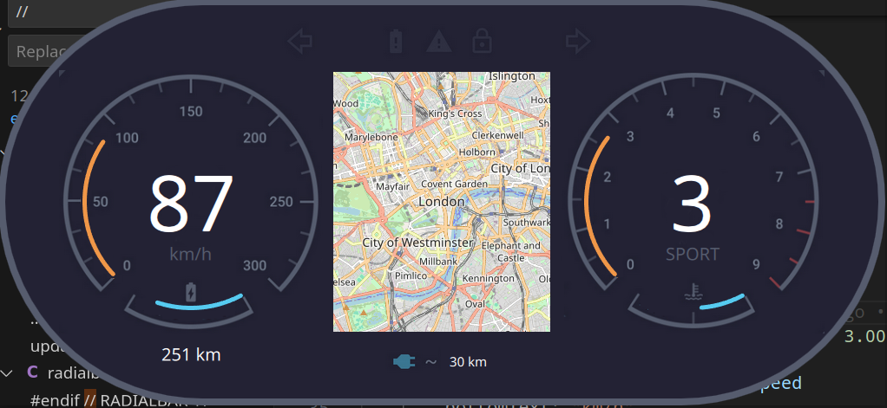

This qml dashbord is made as MVVM, in DataViewModel you can control all data. if You want to change to nicer map, add mapbox key and change plugin in MapModel.qml

Technologies:
QtQuick 6.6 with Location and Positioning insalled

Design found on Internet